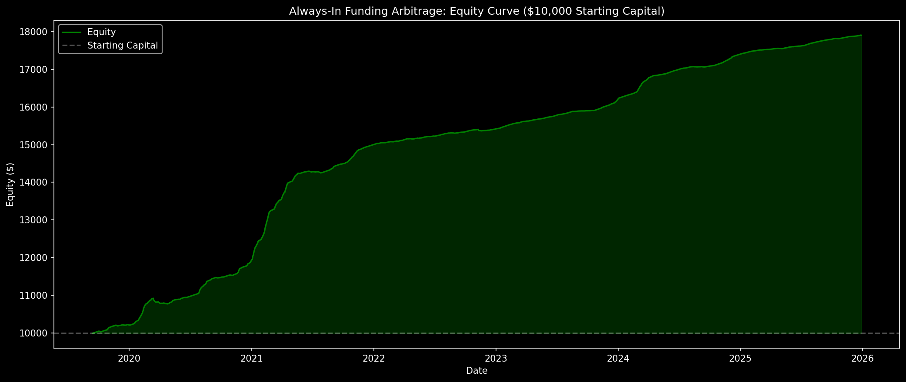
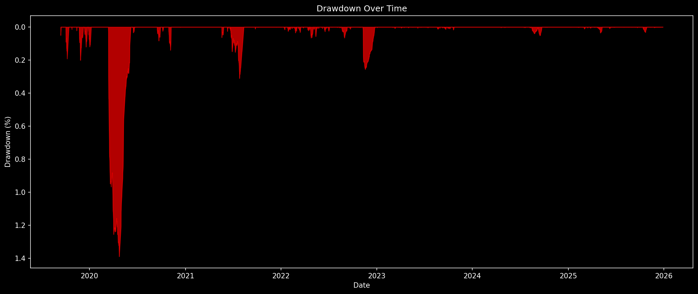
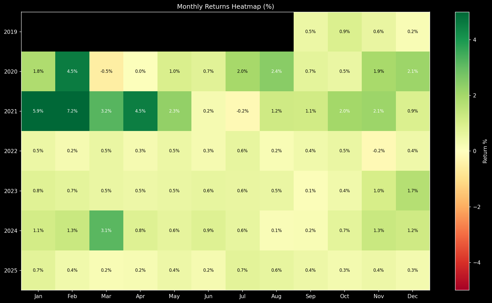
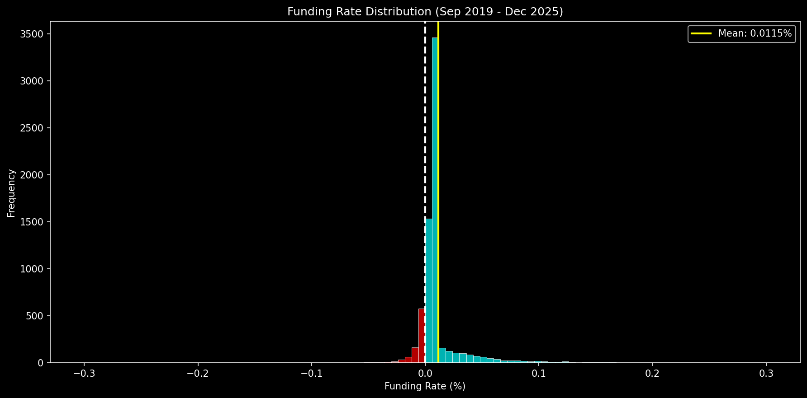

# Always-In Funding Arbitrage: Comprehensive Risk Analysis

**Generated:** 2025-12-28 08:07:19 UTC
**Data Range:** Sep 2019 - Dec 2025 (6,895 funding periods)
**Starting Capital:** $10,000

---

## Executive Summary

| Metric | Value |
|--------|-------|
| **Total Return** | 79.00% |
| **Annualized Return** | 9.68% |
| **Max Drawdown** | 1.39% |
| **Sharpe Ratio** | 11.03 |
| **Calmar Ratio** | 6.97 |

### Final Verdict: **GO**

---

## 1. Equity Curve & Drawdown Analysis

### Drawdown Metrics

| Metric | Value |
|--------|-------|
| Max Drawdown | 1.39% |
| Longest Drawdown | 81 days |
| Number of Drawdown Periods | 13 |

---

## 2. Monthly & Yearly P&L Breakdown

### Monthly Statistics

| Metric | Value |
|--------|-------|
| Best Month | 7.24% |
| Worst Month | -0.53% |
| Median Month | 0.60% |
| Win Rate (Monthly) | 96.1% |

### Yearly Returns

| Year | P&L ($) | Return (%) | Periods |
|------|---------|------------|---------|
| 2019 | $216.95 | 2.17% | 330 |
| 2020 | $1723.97 | 17.24% | 1098 |
| 2021 | $3060.84 | 30.61% | 1095 |
| 2022 | $416.49 | 4.16% | 1095 |
| 2023 | $786.57 | 7.87% | 1095 |
| 2024 | $1195.69 | 11.96% | 1098 |
| 2025 | $499.31 | 4.99% | 1084 |

---

## 3. Funding Rate Distribution

### Statistics

| Metric | Value |
|--------|-------|
| Total Periods | 6,895 |
| Positive Periods | 6,010 (87.2%) |
| Negative Periods | 885 (12.8%) |
| Mean Rate | 0.0115% |
| Median Rate | 0.0100% |
| Std Dev | 0.0215% |
| Min Rate | -0.3000% |
| Max Rate | 0.3000% |

### Worst Negative Streak

- **Duration:** 24 periods (8.0 days)
- **Total Cost:** $103.72

---

## 4. Stress Tests

| Scenario | Periods | Loss ($) | Loss (%) |
|----------|---------|----------|----------|
| 30 days at -0.01% funding | 90 | $90.00 | 0.90% |
| 60 days at -0.01% funding | 180 | $180.00 | 1.80% |
| 30 days at -0.05% (extreme) | 90 | $450.00 | 4.50% |

**Breakeven Rate (1-year hold):** 0.000110% per period

---

## 5. Liquidation Risk Analysis

### Perpetual Short Position (Per Leverage)

| Leverage | Price Increase to Liquidation | Margin Required |
|----------|------------------------------|-----------------|
| 2x | 49.5% | 50.0% |
| 3x | 32.8% | 33.3% |
| 5x | 19.5% | 20.0% |
| 10x | 9.5% | 10.0% |

### Pump Survival Analysis

To survive a price pump, you need sufficient margin:

| BTC Pump | Recommended Leverage | Notes |
|----------|---------------------|-------|
| 50% | 2x or less | Typical bull run spike |
| 100% | 1x only | Major bull market |
| 200% | 1x + buffer | Extreme scenario |

**Recommendation:** Use 1x-2x leverage maximum for perpetual short to survive 50%+ pumps

---

## 6. Capital Requirements

| Component | Amount ($) |
|-----------|------------|
| Spot Position (BTC) | $10,000.00 |
| Perp Margin (2x leverage) | $5,000.00 |
| Negative Funding Buffer | $270.00 |
| **Total Recommended** | **$15,270.00** |

**Capital Efficiency:** 65.5%

*Note: For $10,000 notional exposure, you need ~$15,270 total capital.*

---

## 7. Risk-Adjusted Metrics

| Metric | Value | Interpretation |
|--------|-------|----------------|
| Sharpe Ratio | 11.03 | Excellent |
| Sortino Ratio | 18.43 | Excellent |
| Calmar Ratio | 6.97 | Excellent |

---

## 8. GO / NO-GO Evaluation

| Metric | Actual | Threshold | Status |
|--------|--------|-----------|--------|
| Max Drawdown | 1.39% | <15.0% | **GO** |
| Worst Month | -0.53% | >-5.0% | **GO** |
| Negative Streak | 8.0 days | <45 days | **GO** |
| Sharpe Ratio | 11.03 | >1.0 | **GO** |
| Calmar Ratio | 6.97 | >0.5 | **GO** |

### Final Decision: **GO**

- GO criteria met: 5/5
- NO-GO criteria triggered: 0/5

---

## Key Risks Identified

1. **Negative Funding Periods:** 12.8% of all periods have negative funding. Extended bearish sentiment can lead to consecutive losses.

2. **Liquidation Risk:** If using leverage on the perpetual short, a rapid BTC pump (>50%) could liquidate the position before funding profits accumulate.

3. **Exchange Risk:** Keeping funds on centralized exchanges exposes capital to hacks, insolvency, or withdrawal restrictions.

4. **Execution Risk:** Slippage during entry/exit can erode profits. Market orders in volatile conditions may get worse fills.

5. **Basis Risk:** Spot and perpetual prices may diverge temporarily, causing mark-to-market losses even if delta-neutral.

---

## Recommendations

1. **Start with 1x leverage** on perpetual to survive 100%+ pumps
2. **Use $15,270+** total capital for $10,000 exposure
3. **Monitor funding rates** during extreme market conditions
4. **Set stop-loss** if cumulative drawdown exceeds 10%
5. **Diversify across exchanges** (Binance, OKX) to reduce counterparty risk

---

*Report generated by comprehensive_risk_analysis.py*
